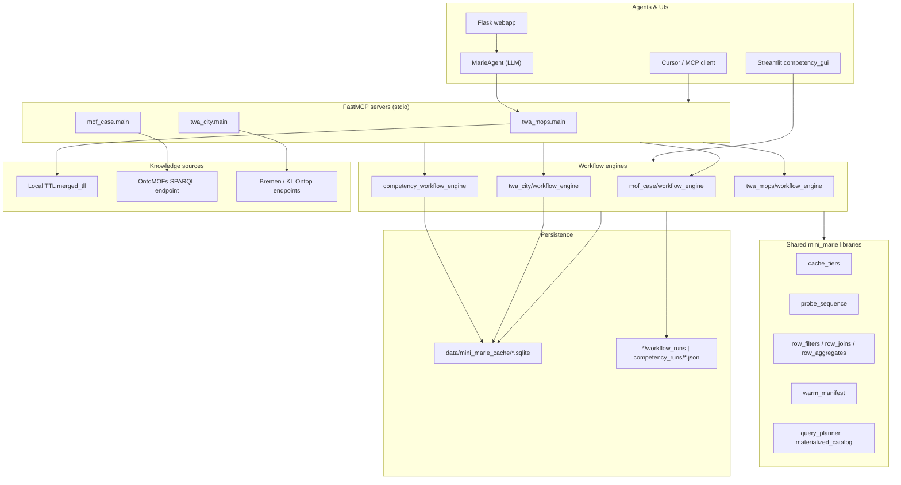

# mini_marie — System architecture

## Purpose

mini_marie bridges **large SPARQL knowledge graphs** and **LLM agents** that have limited context and latency budgets. Instead of exposing raw SPARQL, each TWA exposes:

- **Atomic MCP tools** — Single-purpose queries with built-in `LIMIT` and stable column shapes.
- **Workflow definitions** — JSON step lists that chain atomics, transforms, and optional residual SPARQL.
- **SQLite materialization** — Full-tier results indexed as **facets** for offline joins.
- **MCP workflow tools** — `run_workflow_online` / `replay_workflow_offline` with compact agent-facing output.

---

## High-level diagram

---

## Domain modules

### `twa_mops` — Metal-Organic Polyhedra (local)

| Module | Role |
|--------|------|
| `main.py` | FastMCP server: list MOPs, syntheses, properties |
| `twa_operations.py` | RDF load from `evaluation/data/merged_tll`, SPARQL helpers |
| `workflow_engine.py` | Chained workflows over local graph |
| `workflow_mcp.py` | Agent-facing online/offline workflow tools |
| `workflows/*.json` | e.g. `list_mops_catalog`, `synthesis_profile` |

**Characteristic:** No remote endpoint; offline cap bounded by local graph size (~50k rows).

### `mof_case` — OntoMOFs (remote)

| Module | Role |
|--------|------|
| `main.py` | FastMCP: corpus stats, Tobassco/CO2, competency atomics, workflow tools |
| `mof_operations.py` | SPARQL to `http://68.183.227.15:3840/ontop/sparql/` |
| `mof_competency_operations.py` | Named-MOF competency tools (UiO-66, ZIF-8, …) |
| `workflow_engine.py` | MOF analytics workflows (topology, CO2 ranking) |
| `competency_workflow_engine.py` | 24+ human competency workflows |
| `competency_cache.py` | SQLite + `invoke_tool()` + facet indexes |
| `competency_cache.py` | `TOOL_REGISTRY`, warm helpers |
| `workflows/competency_suite.json` | Competency workflow manifest |

**Characteristic:** Heavy corpus; competency path uses **probe tier (10)** online and **full tier** + **local_join** offline.

### `twa_city` — Urban buildings (remote)

| Module | Role |
|--------|------|
| `main.py` | FastMCP: building lists, heights, WKT locations |
| `twa_city_operations.py` | Bremen / Kaiserslautern SPARQL |
| `city_cache.py` | SQLite facets (`facet_building_height`, `facet_building_location`) |
| `workflow_engine.py` | Multi-step location / filter workflows |
| `gis_visualization.py` | Folium maps from workflow results |

**Characteristic:** GeoSPARQL `wkt` for map tab in competency GUI.

---

## Shared libraries

### Cache paths (`cache_paths.py`)

Resolves `MINI_MARIE_DATA_DIR` or `<repo>/data`, then `mini_marie_cache/<domain>/`.

### Cache tiers (`cache_tiers.py`)

| Tier | `row_limit` | Use |
|------|-----------|-----|
| `probe` | 10 (default) | Online MCP/CLI validation |
| `full` | `None` | Offline replay, warm scripts |

Cache keys are SHA-256 of canonical `{tool, args, tier, row_limit}`.

### Probe sequence (`probe_sequence.py`)

Online runs build **`probed_sequence`**: merged workflow step defs + resolved args from `call_trace`. Offline replay uses this list as the **source of truth** (not a fresh parse of workflow JSON), so agent-driven argument resolution is preserved.

### Row algebra (`row_filters.py`, `row_joins.py`, `row_aggregates.py`)

Generic in-memory transforms used by competency and city engines:

| Transform | Purpose |
|-----------|---------|
| `filter_rows` | Column predicates (`gte`, `icontains`, `in`, …) |
| `join_rows` | Inner/left/anti join on one or composite keys |
| `multi_join_rows` | Chained joins |
| `group_aggregate` | `GROUP BY` + count/sum/avg/… |
| `top_n_by_field` | Sort + limit (also in domain engines) |

These mirror SPARQL fragments documented in `materialized_catalog.py` for planner coverage.

### Warm manifest (`warm_manifest.py`)

`collect_atomic_specs_from_workflow()` walks workflow JSON, resolves `$variables` from seed scalars, and dedupes `{tool, args}` for `warm_competency_cache.py` / `warm_city_cache.py`.

### Query planner (`query_planner.py`)

Maps a workflow to `{steps, warm_specs, catalog}` for tooling and documentation. Workflows remain authoritative; the planner is heuristic scaffolding.

### Materialized catalog (`materialized_catalog.py`)

Documents **atomics**, **facets**, **transforms**, and **residual SPARQL** per domain. `generate_catalog.py` writes `mof_case/materialized_catalog.json`.

---

## Recording artifact schema

Workflow runs are JSON files under `workflow_runs/` or `competency_runs/`:

| Field | Meaning |
|-------|---------|
| `workflow_id` | Logical id from workflow JSON |
| `mode` | `online` or `offline` |
| `status` | `ok`, `error`, … |
| `call_trace` | Per-step status, rows, timing, SPARQL audit |
| `probed_sequence` | Step list for offline replay (online only) |
| `variables` | Resolved `$variables` after run |
| `answer` / `final_summary` | Human-readable result string |

MCP responses include `recording_path` and a **sample_results** TSV (≤5 rows per step) so agents do not ingest full corpora.

---

## Facet model (MOF competency)

After a **full-tier** atomic call, `CompetencyCache` projects rows into facet tables:

| Facet | Keys | Typical use |
|-------|------|-------------|
| `facet_identity` | `name_lc` | Topology lookup by MOF name |
| `facet_topology_mof` | `topology` | Same-topology peers |
| `facet_synthesis` | `name_lc`, `refcode` | Synthesis by refcode list |
| `facet_metal_source` | `metal` | Source DB counts per metal |
| `facet_linker` | `name_lc` | Linker lookup |
| `facet_refcodes` | `name_lc` | Refcode expansion |

**Local join** step types (`topology_from_identity`, `same_topology_count_local`, …) read facets only — no SPARQL.

City facets: `facet_building_height`, `facet_building_location` (see `twa_city/CITY_CACHING.md`).

Offline location queries use `CityCache.resolve_locations_for_buildings()` (facet → atomic batch → per-IRI). Partial warm (`--locations-top-n`, ~27% full-city facet) is enough for top-N workflows; full-city warm is optional for map-scale coverage.

---

## Failure modes

| Error | Typical cause |
|-------|----------------|
| `CacheMissError` | Offline replay without prior full-tier warm |
| `call_trace length != workflow steps` | Skipped step not appended to trace during probe |
| SPARQL timeout | Heavy residual query; warm atomics first or raise `timeout` in step |
| Missing `merged_tll` | twa_mops workflows without local RDF bootstrap |

---

## Extension points

1. **New atomic tool** — Add function in `*_operations.py`, register in `TOOL_REGISTRY` / MCP `@mcp.tool`, add warm spec if used in workflows.
2. **New workflow** — Add JSON under `workflows/`, reference in `discover_workflow_catalog()`.
3. **New transform** — Implement in `row_*.py` and branch in `competency_workflow_engine` / `twa_city/workflow_engine`.
4. **New facet** — Extend `CompetencyCache._index_*` and local join handlers.

Reload MCP after `main.py` or `workflow_mcp.py` changes.
