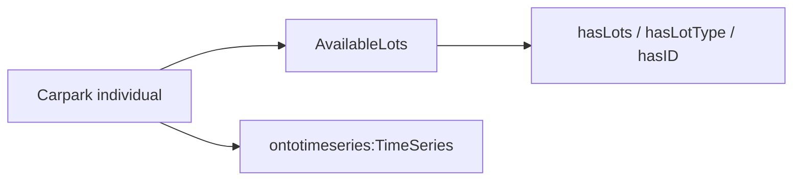
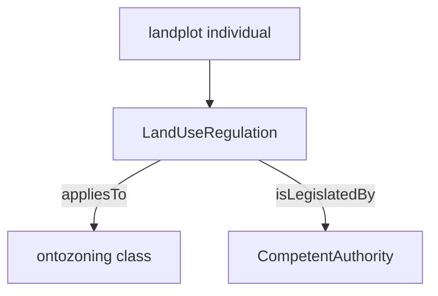
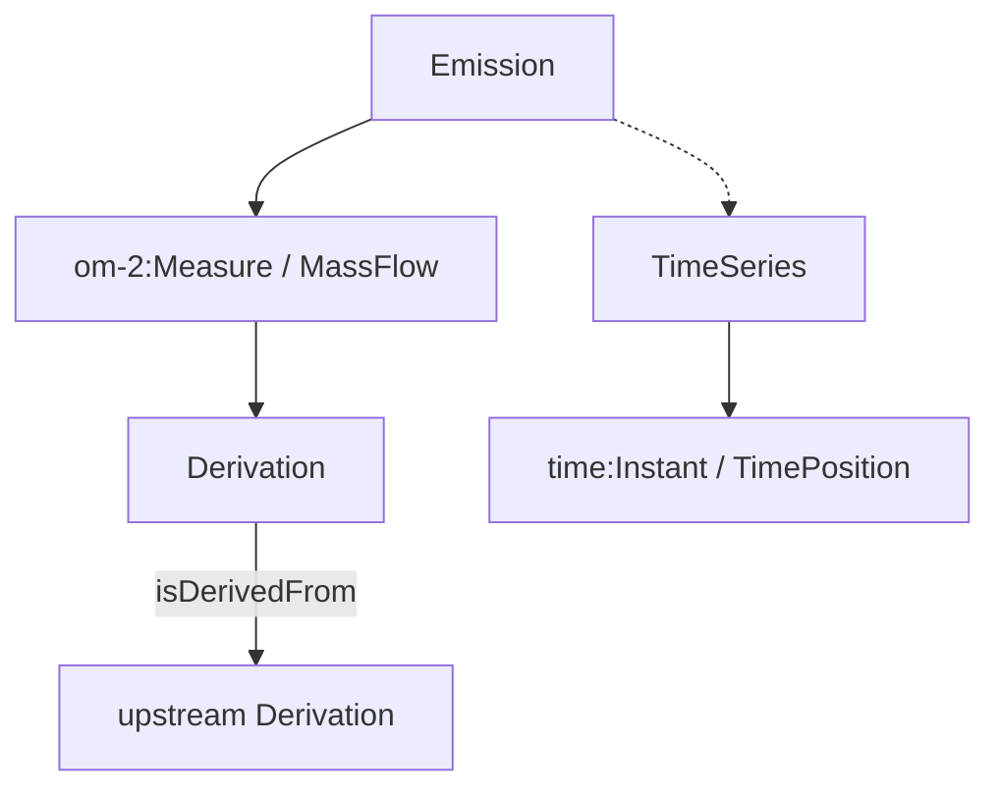

# Singapore stack — `sg-old.theworldavatar.io`

Public HTTPS front for legacy Singapore Blazegraph data. Probed and cached by mini_marie on **2026-06-04**.

**Host:** `https://sg-old.theworldavatar.io`  
**Pattern:** `https://sg-old.theworldavatar.io/blazegraph/namespace/{name}/sparql`

This replaces (for external access) the unreachable `174.138.23.221:3839` and internal Docker names (`sg-blazegraph`, `sg-ontop`) from stack configs.

---

## Access rules (required for queries)

| Rule | Detail |
|------|--------|
| HTTP method | **GET** with `?query=` URL-encoded SPARQL |
| POST | **403 Forbidden** — do not use default `execute_sparql` POST |
| User-Agent | Default Python `urllib` often gets **403**; use e.g. `curl/8.0` |
| Client in repo | `mini_marie.zaha.sg_old.sparql_get.execute_sparql_get` |

---

## Working namespaces (4)

Only these Blazegraph namespaces exist on `sg-old`. Others (`dispersion`, `ontocompany`, `ontobuiltenv`, …) return **404**.

| Namespace | Endpoint | Triples | Subjects | Role |
|-----------|----------|--------:|---------:|------|
| **carpark** | [sparql](https://sg-old.theworldavatar.io/blazegraph/namespace/carpark/sparql) | 3,974 | 1,059 | Carpark **instances** + linked **time series** |
| **company** | [sparql](https://sg-old.theworldavatar.io/blazegraph/namespace/company/sparql) | 989 | 222 | **Ontology / T-box** (OWL), not company A-box data |
| **plot** | [sparql](https://sg-old.theworldavatar.io/blazegraph/namespace/plot/sparql) | 216 | 60 | Singapore **land-use / zoning** regulations |
| **kb** | [sparql](https://sg-old.theworldavatar.io/blazegraph/namespace/kb/sparql) | 115,314 | 47,143 | **Dispersion / emissions** knowledge (maps to old config name `dispersion` → namespace `kb`) |

**Not exposed on sg-old:** Ontop (`/ontop/sparql/`), `feature-info-agent`, `dispersion-interactor` HTTP APIs.

---

## Local cache (full download)

All triples were exported via paginated `SELECT ?s ?p ?o` and stored under:

```
data/mini_marie_cache/sg_old/
├── probe_report.json      # full discovery (types, predicates, stats)
├── summary.json           # compact overview
├── carpark_triples.ndjson
├── carpark_meta.json
├── company_triples.ndjson
├── plot_triples.ndjson
└── kb_triples.ndjson      # ~115k lines, 24 pages @ 5000
```

**Refresh cache:**

```bash
python -m mini_marie.zaha.sg_old.probe_and_cache
python -m mini_marie.zaha.sg_old.probe_and_cache --namespace kb   # single namespace
python -m mini_marie.zaha.sg_old.probe_and_cache --skip-download  # discovery only
```

Each line in `*_triples.ndjson` is `{"s","p","o"}` (string IRIs/literals).

---

## 1. `carpark` — carpark availability & ontology snippets

### What it contains

- **A-box:** Hundreds of carpark-related individuals (availability, capacity, IDs).
- **Ontology references:** Embedded T-box fragments (`ontocarpark`, CityGML building/furniture classes, `ontobuiltenv/Non-Domestic` as classes).
- **Time series linkage:** Most availability individuals link to `ontotimeseries` resources.

### Top instance types (individuals)

| Type | Count |
|------|------:|
| `ontocarpark/AvailableLots` | 362 |
| `ontocarpark/Cars` | 317 |
| `ontocarpark/Carpark` | 317 |
| `ontocarpark/HeavyVehicles` | 22 |
| `ontocarpark/Motorcycles` | 22 |

### Key predicates

| Predicate | Count | Meaning |
|-----------|------:|---------|
| `rdf:type` | 1,059 | Typing |
| `rdfs:label` | 1,053 | Human labels |
| `ontotimeseries/hasTimeSeries` | 362 | Link to time series entity |
| `ontocarpark/hasLots` | 361 | Lot count |
| `ontocarpark/hasLotType` | 361 | Lot category |
| `ontocarpark/hasID` | 317 | External carpark ID |
| `ontocarpark/hasAgency` | 317 | Managing agency (literal) |

### Organization (conceptual)



### Example SPARQL

```sparql
SELECT ?carpark ?label ?lots WHERE {
  ?carpark a <https://www.theworldavatar.com/kg/ontocarpark/Carpark> ;
           <http://www.w3.org/2000/01/rdf-schema#label> ?label ;
           <https://www.theworldavatar.com/kg/ontocarpark/hasLots> ?lots .
} LIMIT 10
```

---

## 2. `company` — OWL ontology (T-box), not operational company KG

### What it contains

Almost entirely **schema**: `owl:Class`, `owl:ObjectProperty`, `owl:Restriction`, labels, comments, `rdfs:subClassOf`.

**No** individuals of type `ontocompany/Company` (count = 0).

Prefixes in use include:

- `http://www.theworldavatar.com/kg/ontocompany/` — company ontology terms
- `http://www.theworldavatar.com/kg/ontochemplant/` — chemical plant extensions
- `http://www.theworldavatar.com/kg/ontocape/...` — CAPE process/system vocabulary
- `http://ontology.eil.utoronto.ca/icontact.owl#` — contact/address classes
- OM-2 units, GeoSPARQL (declared, not instance geometry here)

### Top types

| Type | Count |
|------|------:|
| `owl:Class` | 99 |
| `owl:ObjectProperty` | 42 |
| `owl:DatatypeProperty` | 15 |
| `owl:Restriction` | 14 |

### Organization

This namespace is a **merged ontology document** for the Singapore “company” stack component — useful for **reasoning / property definitions**, not for querying live company records.

---

## 3. `plot` — land use & zoning regulations

### What it contains

Small **A-box** of Singapore planning concepts: land parcels (`landplot/`), zoning types (`ontozoning/`), and regulations (`ontoplanningregulation/`).

### Top types

| Type | Count |
|------|------:|
| `ontoplanningregulation/LandUseRegulation` | 27 |
| `ontozoning/MixedUse` | 4 |
| Various `ontozoning/*` (Business, Agriculture, BeachArea, …) | 1 each |

### Key predicates

| Predicate | Count |
|-----------|------:|
| `rdfs:label` | 64 |
| `rdf:type` | 60 |
| `rdfs:comment` | 33 |
| `ontoplanningregulation/appliesTo` | 32 | Regulation → zoning class |
| `ontoplanningregulation/isLegislatedBy` | 27 | Regulation → competent authority |

### Organization



All 60 subjects sit under `https://www.theworldavatar.com/kg/landplot/`.

---

## 4. `kb` — dispersion & emissions (old name: `dispersion`)

Largest graph. This is the **operational dispersion KB**, not a generic “knowledge base”.

### Scale

| Metric | Value |
|--------|------:|
| Triples | 115,314 |
| Distinct subjects | 47,143 |
| Predicates | 38 |

### Domain counts (instances)

| Class | Count |
|-------|------:|
| `ontodispersion/Emission` | 2,532 |
| `ontoderivation/Derivation` | 845 |
| `ontotimeseries/TimeSeries` | 440 |
| `om-2/Measure` | 9,950 |
| `om-2/MassFlow` | 2,532 |
| `time:Instant` / `time:TimePosition` | ~1,292 |

**No** GeoSPARQL feature **instances** in this export (0 `geosparql#Feature` individuals); geometry may live elsewhere or only as ontology imports.

### Key predicates

| Predicate | Count | Role |
|-----------|------:|------|
| `rdf:type` | 29,448 | Typing |
| `ontoderivation/isDerivedFrom` | 18,658 | Provenance chain |
| `ontoderivation/belongsTo` | 16,073 | Grouping derivations |
| `om-2/hasValue` / `hasNumericalValue` | 9,527 / 7,731 | Measured values |
| `om-2/hasQuantity` | 6,752 | Quantity kind |

### Organization (conceptual)



Primary KG prefixes: `https://www.theworldavatar.com/kg/ontodispersion/`, `ontoderivation/`, `ontotimeseries/`, OM-2.

### Example SPARQL

```sparql
SELECT ?emission ?value WHERE {
  ?emission a <https://www.theworldavatar.com/kg/ontodispersion/Emission> ;
            <http://www.ontology-of-units-of-measure.org/resource/om-2/hasNumericalValue> ?value .
} LIMIT 10
```

---

## Mapping from legacy Singapore YAML

| Legacy key | Legacy URL | sg-old equivalent |
|------------|------------|-------------------|
| `carpark` | `174.138.23.221:3839/.../carpark/sparql` | `https://sg-old.theworldavatar.io/blazegraph/namespace/carpark/sparql` |
| `company` | `.../company/sparql` | same on `sg-old` |
| `plot` | `.../plot/sparql` | same on `sg-old` |
| `dispersion` | `.../namespace/kb/sparql` | **`kb`** namespace on `sg-old` |
| `carpark_internal` | `sg-blazegraph:8080/...` | internal only; use public **carpark** above |
| `ontop` | `174.138.23.221:3839/ontop/...` | **not on sg-old** |
| `feature_info_agent` / `pollutant_concentration` | HTTP agents on `:3839` | **not on sg-old** |

---

## Related tooling

| Script | Purpose |
|--------|---------|
| `python -m mini_marie.zaha.sg_old.probe_and_cache` | Discovery + full NDJSON export |
| `python -m mini_marie.zaha.probe_zaha_stack` | Fast TCP/ASK probe (IP-based stack) |

---

## Limits & caveats

1. **WAF / rate limits** — burst probing can yield temporary 403; space requests and use `User-Agent: curl/8.0`.
2. **POST disabled** — integrate GET client for agents/MCP if sg-old is added as an endpoint.
3. **company ≠ company data** — namespace name is misleading; content is OWL schema.
4. **kb ≠ GIS** — emissions/derivations/time; not building footprints (those are on cmpg city Ontop endpoints when reachable).
5. Cache is a **point-in-time** snapshot; re-run `probe_and_cache` to refresh.
