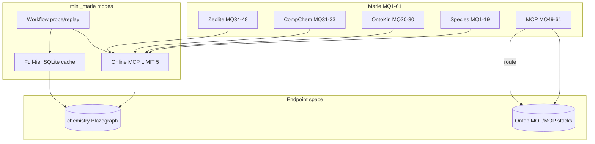

# Marie / Zaha coverage map

Gap analysis for **mini_marie** vs the [Marie demo](https://theworldavatar.io/demos/marie) competency questions and the **chemistry Blazegraph endpoint space**.

**Sources:** [`marie_competency_questions.md`](resources/marie/marie_competency_questions.md), [`chemistry_endpoints.md`](resources/chemistry_endpoints.md), [`COMPETENCY_COVERAGE.md`](../chemistry/COMPETENCY_COVERAGE.md), [`warm_option_catalog.json`](../chemistry/warm_option_catalog.json).

**Refresh live cache counts:**

```bash
python -m mini_marie.marie.chemistry.cache_status --coverage
python -m mini_marie.marie.chemistry.probe_competency          # online smoke (LIMIT 5)
```

Snapshot below: **2026-06-10** (corpus facets 14/15 implemented; atomic 314/314).

---

## Modes (what we mean)

| Mode | Tier | Remote SPARQL | Row limit | Used by |
|------|------|---------------|-----------|---------|
| **Online** | `probe` | Yes (GET, `curl/8.0`) | **5** | MCP atomic tools, `probe_competency`, workflow online probe |
| **Offline atomic** | `full` | **No** | Warm cap per query | `warm_chemistry_cache` (314 variants) |
| **Offline corpus** | `corpus` | Batched warm only | Full entity slices | 14 facet warm CLIs; see [`CORPUS_CACHING.md`](../chemistry/CORPUS_CACHING.md) |

- **Online** always works for implemented tools (up to 5 rows), even when cache is empty.
- **Offline atomic** = filtered `(tool, args)` results — **not** the full KG (~18 MB today).
- **Offline corpus** = materialized indexes (all species names, etc.) — see [`CORPUS_CACHING.md`](../chemistry/CORPUS_CACHING.md).
- **Workflow (W)** = step recorded in [`competency_suite.json`](../chemistry/workflows/competency_suite.json) for probe → replay.

---

## Executive summary

### Competency questions (MQ1–MQ61)

| Area | Count | Share |
|------|------:|------:|
| **Online-capable** (atomic tool exists, live data) | 48 | 79% |
| **Offline-capable** (MQ answer fully replayable from cache today) | 12 | 20% |
| **Partial offline** (some atomics warmed, MQ needs joins/analytics) | 18 | 30% |
| **Gap** (no tool pattern / empty endpoint / multi-step analytics) | 25 | 41% |
| **Routed elsewhere** (MQ49–61 MOPs → `twa-mops` / `mof-twa`) | 13 | 21% |

*(Categories overlap — an MQ can be online-capable but still a partial-offline or gap for full Marie answer.)*

### Endpoint space (chemistry Blazegraph)

| Layer | Covered | Total | Notes |
|-------|--------:|------:|-------|
| Reachable namespaces with A-box | **5** | 8 | `ontospecies`, `ontokin`, `ontocompchem`, `ontozeolite`, `ontoprovenance` |
| Empty / schema-only on this host | 0 | 3 | `kb`, `ontomops`, `ontopesscan` |
| MCP servers wired | **7** | 7 | incl. empty namespaces + routing MCP |
| Generic atomic tools implemented | **7** + 4 generic | per namespace | see [tool matrix](#tool-matrix-by-namespace) |
| Full-space catalog variants | **314 / 314** | 314 | `--coverage` |
| Workflow replay JSON | **3** | 61 | MQ3, MQ21, MQ34 only |

### Related stacks (outside this doc’s cache DB)

| Domain | Stack | Host | Marie overlap |
|--------|-------|------|----------------|
| **mop_mof** | OntoMOFs / `mof-twa` | `68.183.227.15:3840/ontop` | MOF queries; not on chemistry Blazegraph |
| **mop_mof** | `twa-mops` | local `merged_tll` | MQ49–61 MOP instances |
| **zaha** | `sg-old`, `twa-city` | Singapore + Bremen/KL | Buildings/city; not Marie chemistry tab |

---

## Status legend (per MQ)

| Code | Meaning |
|------|---------|
| **O+F+W** | Online probe, offline cache warmed for MQ atomics, workflow JSON |
| **O+F** | Online + offline cache for primary atomics |
| **O~F** | Online works; offline partial (some args cached, not full MQ) |
| **O** | Online only (LIMIT 5); offline not warmed or intentionally skipped |
| **O+W** | Online + workflow; offline depends on warm |
| **gap** | Missing tool, analytics step, or empty endpoint |
| **route** | Not on chemistry Blazegraph — use another MCP |

---

## 1. Competency question mapping (MQ1–MQ61)

### Chemical species — general (`ontospecies`)

| MQ | Question (short) | Tool pattern | Online | Offline | W | Notes |
|----|------------------|--------------|--------|---------|---|-------|
| MQ1 | Ethylene glycol H-bond donor/acceptor | `get_linked_values(SMILES C(CO)O, hasHydrogenBondDonorCount, …)` | O+F | ✓ | ✓ | Corpus physprops + catalog `ontospecies_hbond_smiles`; workflow `mq01_ethylene_glycol_hbond` |
| MQ2 | Uses of 3-amino-2-propanol | `filter_by_literal(hasUse, …)` / `search_species_uses` | O+F | ✓ | ✓ | Corpus `ontospecies_uses` (23k rows); workflow `mq02_amino_propanol_uses` |
| MQ3 | Formula C6H8O6 | `filter_by_literal(hasMolecularFormula, equals)` | O+F | ✓ | ✓ | Workflow `mq03_formula_c6h8o6` |

### Chemical species — pKa / acid-base (`ontospecies`)

| MQ | Question (short) | Tool pattern | Online | Offline | W | Notes |
|----|------------------|--------------|--------|---------|---|-------|
| MQ4 | pKa by InChI (C6H15N) | `get_linked_values(inchi, hasDissociationConstants)` | O+F | ✓ | — | Catalog `ontospecies_pka_inchi` |
| MQ5 | pKa propenoic acid | `get_linked_values(SMILES C=CC(=O)O, …)` | O+F | ✓ | — | Catalog `ontospecies_pka_smiles` |
| MQ6 | pKa CCCC(=O)O | `get_linked_values(SMILES, …)` | O+F | ✓ | — | Same dimension |
| MQ7 | pKa InChI C2H6N2 | `get_linked_values(inchi, …)` | O+F | ✓ | — | Catalog `ontospecies_pka_inchi` |
| MQ8 | Temperature dependence acetic acid pKa | `get_linked_values` + metadata analytics | O~F | partial | — | **gap:** needs acetic acid + temp series; metadata not fully cached |
| MQ9 | perrin2 pKaH1 temperature | metadata / label lookup | O | — | — | **gap:** no `perrin2` in catalog |
| MQ10 | Species pKa at high pressure | aggregate filter on metadata | O | — | — | **gap:** needs aggregate over pKa metadata |
| MQ11 | Most pKaH values | rank / aggregate | O | — | — | **gap:** needs `transform` / aggregate step |
| MQ12 | Ionic strengths methylamine pK | `get_linked_values` + metadata | O~F | partial | — | InChI methylamine in catalog; metadata join incomplete |
| MQ13 | Compounds pK across sources | multi-source join | O | — | — | **gap:** analytics |
| MQ14 | Uncertain reliability methods | metadata analytics | O | — | — | **gap:** analytics |
| MQ15 | Both pKa and pKb | dual property filter | O | — | — | **gap:** not in catalog |
| MQ16 | Uncertain-tagged pK | metadata filter | O | — | — | **gap:** analytics |
| MQ17 | Provenance for methylamine | `ontospecies` + `ontoprovenance` | O~F | partial | — | Cross-namespace; provenance partially warmed |
| MQ18 | Perrin compounds + pK counts | provenance + aggregate | O~F | partial | — | `Perrin` in provenance catalog; counts need workflow |
| MQ19 | pK with acidity label AH | metadata filter | O | — | — | **gap:** analytics |

### Gas-phase mechanisms (`ontokin`)

| MQ | Question (short) | Tool pattern | Online | Offline | W | Notes |
|----|------------------|--------------|--------|---------|---|-------|
| MQ20 | List all mechanisms | `lookup_individuals(ReactionMechanism)` | O | — | — | **O only:** unbounded; no full warm by design |
| MQ21 | Mechanisms with two specific reactions | `traverse_mechanism_reactions` ×2 + join | O~F | partial | ✓ | Workflow covers H2O2 only; dual-reaction join **gap** |
| MQ22 | Mechanisms with O2 and Ar | `traverse` + join | O~F | partial | — | Fragments in catalog; **join gap** |
| MQ23 | Reactions in osti mechanism | `traverse(mechanism_iri_fragment=90098…)` | O~F | partial | — | Catalog dim 0/3 cached at snapshot |
| MQ24 | H2O2-consuming reactions (DOI mechanism) | `traverse` iri + fragment | O~F | partial | — | Same |
| MQ25 | H2 → OH reactions | `traverse(reaction_fragment=H2)` | O~F | partial | — | Fragment in catalog |
| MQ26 | Compare rate constants H2+OH across mechanisms | multi-mechanism join | gap | — | — | **gap:** needs workflow + local_join |
| MQ27 | Kinetic model H2O2+OH | mechanism-scoped model lookup | gap | — | — | **gap:** not in atomic tools |
| MQ28 | Transport models (combustflame DOI) | mechanism_iri + model class | O~F | partial | — | IRI in catalog; model extraction **gap** |
| MQ29 | Compare thermo models of O2 | cross-mechanism compare | gap | — | — | **gap:** analytics |
| MQ30 | Thermo models organic radicals | cross-mechanism compare | gap | — | — | **gap:** analytics |

### Quantum chemistry (`ontocompchem`)

| MQ | Question (short) | Tool pattern | Online | Offline | W | Notes |
|----|------------------|--------------|--------|---------|---|-------|
| MQ31 | ZPE Ar CC-pVTZ vs CC-pVQZ | `query_calculation_results` × basis | O~F | partial | — | **gap:** Ar species + basis compare not catalogued |
| MQ32 | HOMO/LUMO H UB3LYP | `query_calculation_results(homo,lumo)` | O~F | partial | — | Probe species `663e4fd4`; not validated as H |
| MQ33 | H2O rotational RB3LYP/cc-pVDZ | `query_calculation_results(rotational, basis)` | O~F | partial | — | Catalog 3/4; H2O-specific label **gap** |

### Zeolites (`ontozeolite`)

| MQ | Question (short) | Tool pattern | Online | Offline | W | Notes |
|----|------------------|--------------|--------|---------|---|-------|
| MQ34 | Materials framework AEN | `filter_by_literal(hasFrameworkCode, AEN)` | O+F | ✓ | ✓ | Workflow `mq34_framework_aen` |
| MQ35 | Reference zeolite SFN | `query_zeolite_property(SFN, isReferenceZeolite)` | O~F | partial | — | Catalog 1/9 framework codes |
| MQ36 | Framework of \|(Quin)\|[Si34O68] | `lookup` / material label | gap | — | — | **gap:** material_label queries not in catalog |
| MQ37 | Unit cell \|Na20\|[Al20Si76O192] | structure property lookup | gap | — | — | **gap:** property not in warm catalog |
| MQ38 | Tile info UOZ | framework / material property | O~F | partial | — | UOZ not in reference dim; tiles **gap** |
| MQ39 | Occupiable area AFY | numeric property | O~F | partial | — | AFY not warmed; property **gap** |
| MQ40 | Triclinic lattice materials | `filter_by_literal(hasLatticeSystem)` | O~F | partial | — | Dim 0/4 cached at snapshot |
| MQ41 | Area >500 & volume <200 | numeric filter + join | gap | — | — | **gap:** transform/filter pipeline |
| MQ42 | Guest species for FAU | framework + guest traversal | O~F | partial | — | FAU framework warmed; guest list **gap** |
| MQ43 | Materials with H2S guest | `filter_by_literal(hasGuestSpecies, H2S)` | O~F | partial | — | Dim 0/3 cached |
| MQ44 | Frameworks with tetraethylammonium | template / SDA filter | gap | — | — | **gap:** not in catalog |
| MQ45 | Materials Ta + N | element composition filter | gap | — | — | **gap:** not in catalog |
| MQ46 | Frameworks Zn + P only | element filter | gap | — | — | **gap:** not in catalog |
| MQ47 | Species in Al+P zeolites | composition + guest | gap | — | — | **gap:** not in catalog |
| MQ48 | Provenance zeolite material | cross-namespace | gap | — | — | **gap:** ontozeolite + ontoprovenance join |

### Metal–organic polyhedra (`ontomops` → routed)

| MQ | Question (short) | Tool pattern | Online | Offline | W | Notes |
|----|------------------|--------------|--------|---------|---|-------|
| MQ49–MQ61 | MOP geometry, CBU, calc, provenance | `ontomops_instance_routing` | route | route | — | Chemistry namespace **empty** (0 triples); use **`twa-mops`** / **`mof-twa`** MCP |

---

## 2. Endpoint space mapping

### Blazegraph namespaces (chemistry host)

| Namespace | Triples | MCP | Online tools | Full-space catalog | Cache snapshot | Endpoint note |
|-----------|--------:|-----|--------------|-------------------|----------------|---------------|
| **ontospecies** | 50.6M | `chemistry-ontospecies` | 4 generic | 17 variants | **17/17** ✓ | Fragile; filtered warm only |
| **ontokin** | 63k | `chemistry-ontokin` | 4 + `traverse_mechanism_reactions` | 15 variants | **6/15** | Reaction traverse can return 4k+ rows |
| **ontocompchem** | 5.2k | `chemistry-ontocompchem` | 4 + `query_calculation_results` | 4 variants | **3/4** | Species discovery returned 0 labels (IRI fragments used) |
| **ontozeolite** | 21.7M | `chemistry-ontozeolite` | 4 + `query_zeolite_property` | 274 variants | **15/274** | 256 framework codes discovered; bulk warm in progress |
| **ontoprovenance** | 173 | `chemistry-ontoprovenance` | 4 generic | 4 variants | **1/4** | Small; Person lookup |
| **kb** | 0 | — | — | — | — | Empty |
| **ontomops** | 0 | `chemistry-ontomops` | routing only | — | — | Route to twa-mops |
| **ontopesscan** | 0 | `chemistry-ontopesscan` | — | — | — | Empty |

**Off-host:** `ontomofs` / MOF data on Ontop `68.183.227.15:3840` (~850k MOF instances) — see [`mof_case`](../mof_case/) and [`chemistry_endpoints.md`](resources/chemistry_endpoints.md#ontomofs-separate-ontop-stack).

### Tool matrix by namespace

| Tool | ontospecies | ontokin | ontocompchem | ontozeolite | ontoprovenance | ontomops |
|------|:-----------:|:-------:|:------------:|:-----------:|:--------------:|:--------:|
| `lookup_individuals` | ✓ | ✓ | ✓ | ✓ | ✓ | ✓ |
| `get_linked_values` | ✓ | ✓ | ✓ | ✓ | ✓ | ✓ |
| `filter_by_literal` | ✓ | ✓ | ✓ | ✓ | ✓ | ✓ |
| `count_instances` | ✓ | ✓ | ✓ | ✓ | ✓ | ✓ |
| `traverse_mechanism_reactions` | — | ✓ | — | — | — | — |
| `query_calculation_results` | — | — | ✓ | — | — | — |
| `query_zeolite_property` | — | — | — | ✓ | — | — |
| `ontomops_instance_routing` | — | — | — | — | — | ✓ |

**Online:** all ✓ cells work via MCP (LIMIT 5).  
**Offline:** only warmed `(tool, args)` pairs in `data/mini_marie_cache/chemistry/chemistry_cache.sqlite`.

### Full-space catalog dimensions (314 variants)

| Dimension ID | Tool | Options | Cached / total | MQs touched |
|--------------|------|--------:|---------------:|-------------|
| `ontospecies_formula_equals` | `filter_by_literal` | 5 formulas | 5/5 | MQ3 |
| `ontospecies_use_contains` | `filter_by_literal` | 3 uses | 3/3 | MQ2 |
| `ontospecies_pka_smiles` | `get_linked_values` | 3 | 3/3 | MQ5–6 |
| `ontospecies_pka_inchi` | `get_linked_values` | 3 | 3/3 | MQ4,7,12 |
| `ontospecies_hbond_smiles` | `get_linked_values` | 1 | 1/1 | MQ1 |
| `ontospecies_count` | `count_instances` | 2 | 2/2 | — |
| `ontokin_reaction_fragment` | `traverse_mechanism_reactions` | 10 | 5/10 | MQ21–25 |
| `ontokin_mechanism_iri` | `traverse_mechanism_reactions` | 3 | 0/3 | MQ23–24,28 |
| `ontokin_count` | `count_instances` | 2 | 1/2 | MQ20 (partial) |
| `ontocompchem_results` | `query_calculation_results` | 4 | 3/4 | MQ31–33 |
| `ontozeolite_framework_materials` | `filter_by_literal` | **256** codes | 13/256 | MQ34,42 |
| `ontozeolite_reference_property` | `query_zeolite_property` | 9 | 1/9 | MQ35 |
| `ontozeolite_lattice_system` | `filter_by_literal` | 4 | 0/4 | MQ40 |
| `ontozeolite_guest_species` | `filter_by_literal` | 3 | 0/3 | MQ43 |
| `ontozeolite_count` | `count_instances` | 2 | 1/2 | — |
| `ontoprovenance_person` | `lookup_individuals` | 4 | 1/4 | MQ17–18 |

**Catalog coverage:** 314 / 314 (**100%**) — all warm_option_catalog dimensions cached.

### What “entire endpoint space” means vs what we cache

| Space | Size (order of magnitude) | Atomic cache (today) | Corpus cache (direction) |
|-------|---------------------------|----------------------|---------------------------|
| All triples in namespace | 50M+ (ontospecies) | **Not stored** | **Not stored** |
| All species + names | ~37k species, ~350k names | 58 result rows | **`ontospecies_names` complete** |
| pKa measurements | ~1.2k species, ~3k rows | seed queries | **`ontospecies_pka` corpus** |
| OntoKin reaction graph | ~12k edges | partial atomic | **`ontokin_reaction_graph` corpus** |
| Zeolite materials + props | materials corpus | 256 framework atomics | **`warm_zeolite_corpus`** |
| Marie example questions | 61 | Tool + catalog + workflow | MQs guide corpus facets |
| Competency workflows | 61 | 3 JSON workflows | — |

We do **not** mirror raw triple stores. We build **corpus indexes per MCP concern** (name search, reaction index, …) via resumable batch warms.

**Start species corpus warm:**

```bash
python -m mini_marie.marie.chemistry.warm_species_corpus --batch-size 50 --max-batches 1 --delay 3
python -m mini_marie.marie.chemistry.warm_species_corpus --status
```

---

## 3. Coverage diagram



---

## 4. Largest gaps (priority)

| Priority | Gap | Affects | Suggested next step |
|----------|-----|---------|---------------------|
| P0 | Finish framework-code warm (243 missing) | MQ34,42, endpoint space | `--full-space --dimension ontozeolite_framework_materials --missing-only` |
| P1 | MQ26–30 multi-mechanism analytics | OntoKin advanced | Extend `competency_suite.json` + `local_join` / transforms |
| P1 | MQ8–19 pKa metadata analytics | OntoSpecies acid-base | Catalog acetic/perrin2 + aggregate workflow steps |
| P2 | MQ36–48 zeolite structure/material queries | OntoZeolite | Add `material_label`, unit cell, tile, area dims to catalog |
| P2 | MQ31–33 compchem species enumeration | OntoCompChem | Fix species discover SPARQL; expand species×basis grid |
| P3 | MQ49–61 MOP instances | OntoMOPs | Wire Marie routing to `twa-mops` workflows + cache |
| P3 | MQ20 unbounded mechanism list | OntoKin | Optional capped warm or paginated SPARQL plan |

---

## 5. Commands to update this map

```bash
# Live cache coverage (feeds section 2 table)
python -m mini_marie.marie.chemistry.cache_status --coverage

# Online smoke across namespaces
python -m mini_marie.marie.chemistry.probe_competency

# Discover endpoint enumerations (framework codes, etc.)
python -m mini_marie.marie.chemistry.discover_warm_options

# Continue incremental warm
python -m mini_marie.marie.chemistry.warm_chemistry_cache --full-space --missing-only --delay 3
```

---

## Related docs

- [Marie competency questions (full text)](resources/marie/marie_competency_questions.md)
- [Chemistry endpoints + namespaces](resources/chemistry_endpoints.md)
- [Chemistry caching architecture](../chemistry/CHEMISTRY_CACHING.md) — atomic tier
- [Corpus caching](../chemistry/CORPUS_CACHING.md) — **full KG facets by query pattern**
- [Competency tool mapping](../chemistry/COMPETENCY_COVERAGE.md)

```bash
python -m mini_marie.marie.chemistry.list_corpus_facets --summary
```
