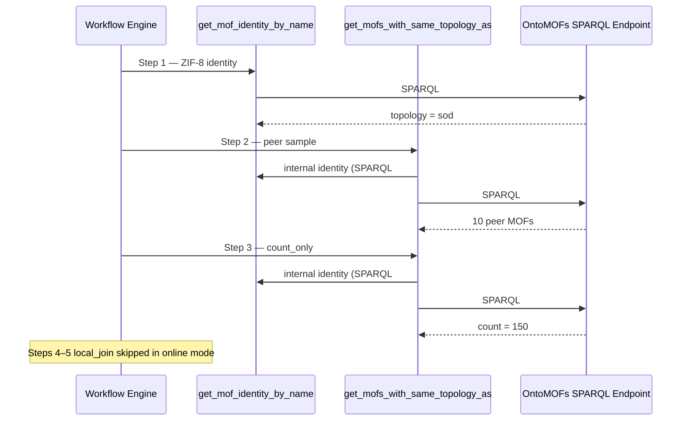

# CQ07: MOFs with the Same Topology as ZIF-8

**Competency question (English):** Which MOFs have the same topology as ZIF-8?

**Workflow ID:** `CQ07_SAME_TOPO_ZIF8`  
**Manifest:** `workflows/competency_suite.json`  
**SPARQL endpoint:** `http://68.183.227.15:3840/ontop/sparql/`  
**Ontology prefix:** `mofs: <https://www.theworldavatar.com/kg/ontomofs_vkg/>`

This document describes the **online probe** path: atomic SPARQL tools, their coordination, and the queries actually sent to the endpoint (cold cache).

---

## Answer summary (online probe run)


| Field                           | Value                           |
| ------------------------------- | ------------------------------- |
| Reference MOF                   | ZIF-8                           |
| Resolved topology               | **sod** (RCSR symbol)           |
| Peer MOF count (excl. ZIF-8)    | **150**                         |
| Sample rows returned (LIMIT 10) | 10 identity rows + 10 peer MOFs |
| Online limit                    | 10 per list step                |


Example recording: `competency_runs/CQ07_SAME_TOPO_ZIF8_online_*.json`

Re-run online probe:

```bash
python -m mini_marie.mop_mof.mof.run_competency_probe --workflow CQ07_SAME_TOPO_ZIF8 --online-limit 10
```

---


## Workflow steps


| Step | Type       | Tool / join                                            | Online behaviour                                           |
| ---- | ---------- | ------------------------------------------------------ | ---------------------------------------------------------- |
| 1    | tool       | `get_mof_identity_by_name("ZIF-8")`                    | Remote SPARQL, `LIMIT 10`                                  |
| 2    | tool       | `get_mofs_with_same_topology_as("ZIF-8")`              | Internal identity lookup + sod topology sample, `LIMIT 10` |
| 3    | tool       | `get_mofs_with_same_topology_as(..., count_only=true)` | Internal identity + **COUNT** (no `LIMIT`)                 |
| 4    | local_join | `topology_from_identity`                               | **Skipped** (`offline_only`)                               |
| 5    | local_join | `same_topology_count_local`                            | **Skipped** (`offline_only`)                               |


**Design intent**

1. **Two-step topology query** — resolve ZIF-8 identity first, then filter by `hasRCSRSym` to avoid expensive joins on ~850k MOFs.
2. **Sample + count split** — step 2 returns a probe sample; step 3 returns the authoritative corpus count.
3. **Offline enrichment** — steps 4–5 use the local SQLite facet cache (`competency_cache.sqlite`) for topology resolution and local recount without remote SPARQL.

---


## Online SPARQL sequence

MOF competency tools embed SPARQL in `mof_competency_operations.py`. On a **cold cache**, CQ07 triggers the following queries in order.

### SPARQL #1 — Step 1: ZIF-8 identity

```sparql
PREFIX mofs: <https://www.theworldavatar.com/kg/ontomofs_vkg/>
SELECT ?name ?sourcedb ?topology ?space_group ?refcode ?mofid
WHERE {
  ?mof mofs:hasNames ?name .
  OPTIONAL { ?mof mofs:hasSourcedb ?sourcedb }
  OPTIONAL { ?mof mofs:hasRCSRSym ?topology }
  OPTIONAL { ?mof mofs:hasSpaceGroupNumber ?space_group }
  OPTIONAL { ?mof mofs:hasCsdRefcode ?refcode }
  OPTIONAL { ?mof mofs:hasMofidV1 ?mofid }
  FILTER(LCASE(STR(?name)) = "zif-8")
}
LIMIT 10
```

**Observed:** topology = `sod`; multiple CoRE MOF 2025 records (refcodes e.g. EWIDUK, FAWCEN, NIFREC).

---


### SPARQL #2 — Step 2 (internal): identity again

`get_mofs_with_same_topology_as` calls `get_mof_identity_by_name` internally before the topology filter. Same query as #1 (served from probe cache when warm).

---


### SPARQL #3 — Step 2: sod-topology peer sample

```sparql
PREFIX mofs: <https://www.theworldavatar.com/kg/ontomofs_vkg/>
SELECT ?mof ?source ?topology
WHERE {
  ?mof mofs:hasSourcedb ?source ; mofs:hasRCSRSym ?topology .
  FILTER(LCASE(STR(?topology)) = "sod")
  FILTER NOT EXISTS {
    ?mof mofs:hasNames ?refname .
    FILTER(LCASE(STR(?refname)) = "zif-8")
  }
}
LIMIT 10
```

**Observed:** 10 peer MOFs (Cu, Co, In, Zn, …) from CoRE MOF 2025, all `topology = sod`.

---


### SPARQL #4 — Step 3 (internal): identity again

Same as #1 (typically cache hit after step 1).

---


### SPARQL #5 — Step 3: authoritative peer count

```sparql
PREFIX mofs: <https://www.theworldavatar.com/kg/ontomofs_vkg/>
SELECT (COUNT(DISTINCT ?mof) AS ?count)
WHERE {
  ?mof mofs:hasRCSRSym ?topology .
  FILTER(LCASE(STR(?topology)) = "sod")
  FILTER NOT EXISTS {
    ?mof mofs:hasNames ?refname .
    FILTER(LCASE(STR(?refname)) = "zif-8")
  }
}
```

**Observed:** `count = 150`, `topology = sod`. No `LIMIT` — this is the authoritative online count.

---


## Coordination diagram




---


## Offline replay (brief)

After warming full-tier atomics, offline replay runs steps 4–5 against `competency_cache.sqlite`:

- `topology_from_identity` — resolve `sod` from cached identity facet for `ZIF-8`.
- `same_topology_count_local` — count peers in the topology facet, excluding the reference name.

Final answer template:

```
topology=$topology; corpus_count=$sparql_count; facet_sample_count=$local_count
```

---


## Related source files


| File                              | Role                                                                    |
| --------------------------------- | ----------------------------------------------------------------------- |
| `workflows/competency_suite.json` | Workflow definition (`CQ07_SAME_TOPO_ZIF8`)                             |
| `mof_competency_operations.py`    | SPARQL for `get_mof_identity_by_name`, `get_mofs_with_same_topology_as` |
| `competency_workflow_engine.py`   | Online/offline step runner, `probed_sequence` recording                 |
| `competency_cache.py`             | Probe/full cache tiers, facet tables                                    |
| `run_competency_probe.py`         | CLI to run online probe and save recording                              |


